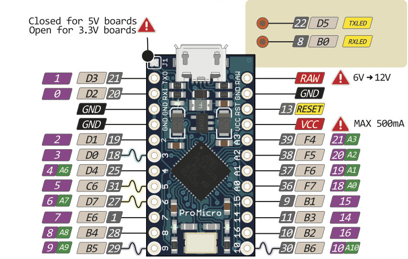

# Wood Splitt Keyboard 

make 9key:default

Build with 2x Pro Micro

Pinout for ref

See [build environment setup](https://docs.qmk.fm/#/getting_started_build_tools) then the [make instructions](https://docs.qmk.fm/#/getting_started_make_guide) for more information.